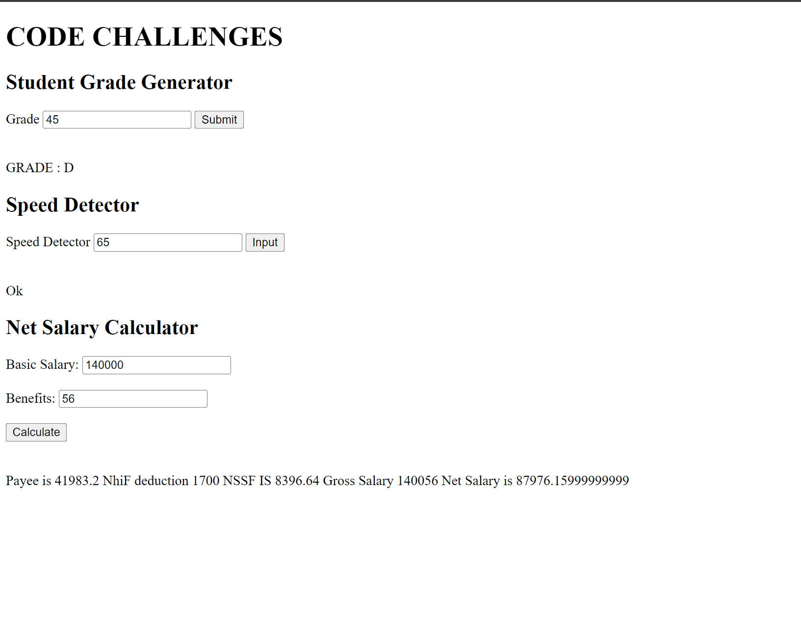

# TOY PROBLEMS

Short description of what the project does.
#### -The projects consist of 3 fun challenges 
    -   Challenge 1 is a Student Grade Generator 
    -   Challenge 2 is a speed detector 
    -   Challenge 3 was a Net salary calculator
    
## Table of Contents

- [Installation](#installation)
- [Usage](#usage)
- [Features](#features)
- [Contributing](#contributing)
- [License](#license)

## Installation

Step-by-step guide on how to install or set up the project.
-To install go to github crisperi repository 
-You can fork it to your own computer 
-After git clone ssh/https . run the html document

## Usage

Instructions on how to use the project, including code examples or demos.
-The project has labelled forms which will require an input from the user to display the needed query

## Features

- Feature 1 - GET AND USE USERS CURRENT INPUT 
- Feature 2
- ...

## Contributing

Guidelines for contributing to the project, including how to report bugs or submit pull requests.

## License

This project is licensed under the [License Name](license-file) - see the [LICENSE.md](LICENSE.md) file for details.

